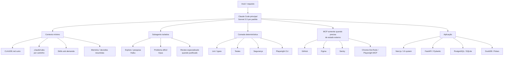
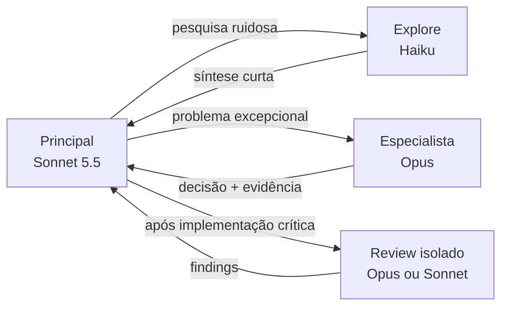
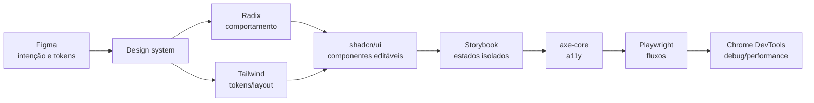
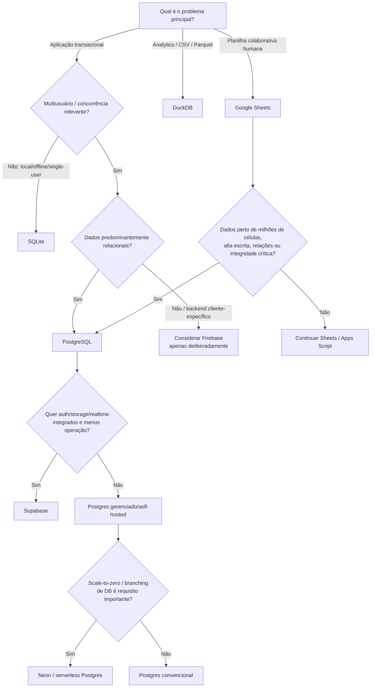
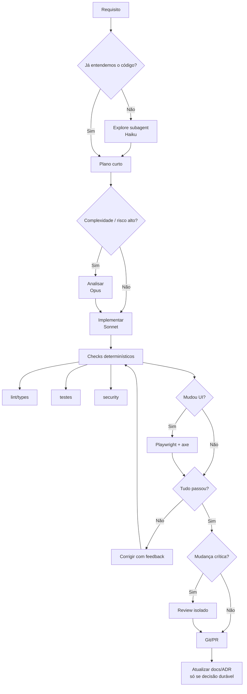
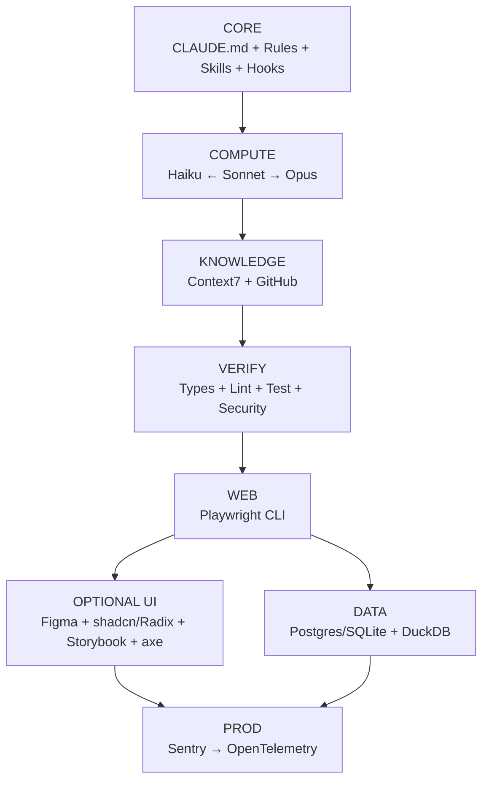

# Pesquisa profunda: stack profissional para Claude Code em desenvolvimento de aplicações

**Corte da pesquisa: 4 de outubro de 2026, America/Sao_Paulo.**  
**Escopo:** Claude Code, Skills, MCPs, bibliotecas, ferramentas de desenvolvimento, UI/UX, bancos, dados, planilhas, testes, observabilidade e segurança. Foram priorizadas documentação oficial, repositórios originais e produtores técnicos reconhecidos. Métricas de GitHub são um retrato desta data e **não são usadas como proxy de qualidade**, apenas como sinal secundário de adoção.

## Resumo executivo

A principal conclusão da pesquisa é contraintuitiva:

> **A melhor stack para Claude Code não é a que instala mais MCPs. É a que coloca o mínimo possível de informação permanente no contexto, torna o máximo possível de verificações determinísticas e oferece ferramentas externas sob demanda.**

Isso é especialmente importante porque o próprio ecossistema mudou em 2026. Claude Code hoje combina `CLAUDE.md`, regras por caminho, memória automática, Skills, hooks, subagents e MCP; subagents podem receber modelo, ferramentas, Skills, memória e esforço próprios. A documentação da Anthropic recomenda manter `CLAUDE.md` conciso — aproximadamente abaixo de 200 linhas — e carregar regras específicas por caminho apenas quando relevantes. Minha recomendação central é esta:



Essa arquitetura deriva diretamente de quatro achados importantes:

**Primeiro: contexto permanente é caro.** A Anthropic orienta colocar em `CLAUDE.md` apenas convenções estáveis, comandos, arquitetura e regras que Claude deve sempre observar. Procedimentos especializados devem migrar para Skills ou regras específicas por caminho; documentos muito longos consomem mais contexto e tendem a ter menor aderência. Importar outros arquivos para `CLAUDE.md` ajuda organização, mas não elimina o custo de contexto do conteúdo importado. **Segundo: subagents têm valor principalmente como mecanismo de isolamento de contexto, não como “equipe virtual”.** O Explore agent pode usar Haiku, resultados volumosos de exploração podem permanecer fora do contexto principal e subagents podem ter configuração própria de modelo e ferramentas. Isso justifica pesquisador/explorador especializado; não justifica criar sete agentes para alterar um botão. **Terceiro: CLI frequentemente é melhor que MCP para tarefas determinísticas.** A própria Microsoft passou a recomendar Playwright CLI + Skills para coding agents quando economia de contexto importa: a documentação declara explicitamente que CLI evita carregar grandes schemas de ferramentas e árvores de acessibilidade no contexto; MCP continua melhor quando estado persistente e introspecção interativa são realmente necessários. **Quarto: mais reasoning e modelos maiores não devem ser o padrão.** Em outubro de 2026, Sonnet 5.5 é a opção de custo/velocidade muito forte para trabalho cotidiano; Opus 5.5 deve entrar para problemas realmente difíceis; Haiku 4.5 funciona particularmente bem para exploração e trabalho auxiliar; Fable 5.1 é a opção extrema para raciocínio/long-horizon quando nem Opus com esforço elevado é suficiente. A Anthropic explicitamente posiciona os modelos dessa forma e os subagents permitem roteamento por modelo. ### O núcleo que eu instalaria primeiro

Se eu tivesse de reduzir toda a pesquisa a **dez decisões**, seriam estas:

| Prioridade | Decisão |
|---|---|
| Essencial | `CLAUDE.md` curto + `.claude/rules/` por domínio |
| Essencial | Skills para workflows repetidos, não prompts gigantes |
| Essencial | Sonnet como agente principal; Haiku para Explore; Opus sob escalonamento |
| Essencial | Hooks + lint/typecheck/testes como verificadores determinísticos |
| Essencial | Context7 CLI/Skill para documentação atualizada |
| Essencial | GitHub MCP oficial, preferencialmente read-only por padrão |
| Essencial | Playwright **CLI + Skill** antes de Playwright MCP |
| Projetos de UI | Figma MCP + shadcn/Radix/Tailwind + Storybook + axe |
| Dados | PostgreSQL para apps multiusuário; SQLite local; DuckDB para analytics |
| Produção | Sentry + segurança automatizada; OpenTelemetry quando complexidade justificar |

O ponto crítico é que **o segundo grupo não deve ser carregado permanentemente no contexto**. Figma, Sentry, navegador, banco e GitHub são capacidades que Claude deve acessar quando necessário.

## Arquitetura de contexto, modelos e trabalho com Claude Code

A melhor forma de economizar tokens não é “escrever prompts menores”; é impedir que informações irrelevantes participem de cada turno.

A própria arquitetura atual do Claude Code já oferece os mecanismos necessários: `CLAUDE.md`, memória automática, Skills, regras, hooks, subagents e MCP. Claude Code também faz busca agentiva no codebase e, segundo a documentação do produto, não depende de um índice remoto permanente do seu código. Por isso, **eu não colocaria um banco vetorial/semantic code index externo na stack básica** sem um problema mensurável que o justifique. **Distribuição recomendada da informação:**

| Informação | Onde deve ficar | Motivo |
|---|---|---|
| Comandos de build/test/lint | `CLAUDE.md` | Claude precisa sempre saber |
| Convenções arquiteturais invariáveis | `CLAUDE.md` | Alto valor e uso recorrente |
| “Nunca faça X” / “sempre faça Y” | `CLAUDE.md` | Regra global |
| Regras exclusivas do frontend | `.claude/rules/` com path | Só entram quando frontend for relevante |
| Regras de migrations/DB | regra por caminho ou Skill | Evita poluir tarefas de UI |
| Workflow “criar migration” | Skill | Procedimento multi-etapas |
| Workflow “auditar UI” | Skill | Só deve aparecer sob demanda |
| Decisões arquiteturais históricas | `docs/adr/` | Consultáveis, mas não precisam estar sempre no prompt |
| Especificação funcional | `docs/specs/` | Fonte de verdade consultável |
| Status de tarefas | Issues/TODO | Estado mutável, não arquitetura |
| Preferências e correções recorrentes | auto-memory | A Anthropic reserva memória para esse tipo de informação |
| Explicação humana do projeto | README | Onboarding, não prompt permanente |

A Anthropic informa que a memória automática carrega apenas uma parcela limitada de seu arquivo principal e recomenda especificamente mover procedimentos de múltiplos passos para Skills e regras específicas para arquivos para regras por caminho. Também recomenda aproximadamente **menos de 200 linhas por `CLAUDE.md`**; conteúdo excessivo aumenta contexto e reduz aderência. `AGENTS.md` tornou-se um formato interoperável relevante e já aparece em dezenas de milhares de projetos open source, mas eu **não duplicaria as mesmas regras em `AGENTS.md` e `CLAUDE.md`**. Para projetos usados por vários agentes, vale adotar `AGENTS.md` para a camada portátil e reservar `CLAUDE.md` para comportamento específico do Claude; para projetos só com Claude, a duplicação cria uma nova oportunidade para documentação contraditória. ### Estratégia de modelos

Em setembro de 2026, a Anthropic lançou Opus 5.5 e Sonnet 5.5; Sonnet 5.5 manteve o preço de **US$ 2/MTok de entrada e US$ 10/MTok de saída**, enquanto Opus 5.5 está em **US$ 4/MTok e US$ 20/MTok**. Haiku 4.5 permanece muito mais barato, a **US$ 1/MTok e US$ 5/MTok**. A Anthropic afirma que Sonnet 5.5 ficou mais de 30% mais rápido que Sonnet 5 e pode consumir até cerca de 30% menos por tarefa em suas medições; isso é **benchmark do fornecedor**, não evidência independente. | Tarefa | Modelo recomendado | Effort | Razão |
|---|---|---:|---|
| Navegar arquivos e localizar implementação | Haiku 4.5 subagent | baixo | Alta relação custo/benefício |
| Resumir logs grandes | Haiku | baixo–médio | Compressão auxiliar |
| CRUD, endpoints, componentes usuais | Sonnet 5.5 | médio | Default operacional |
| Refatoração moderada | Sonnet | médio–alto | Boa capacidade sem pagar Opus |
| Planejamento arquitetural simples | Sonnet | alto | Não escalar prematuramente |
| Bug difícil cross-stack | Opus 5.5 | alto | Maior capacidade de raciocínio |
| Migration perigosa | Opus + testes | alto | Custo do erro domina custo do modelo |
| Revisão de PR crítico | Opus | alto | Segunda passada justificada |
| Pesquisa volumosa | Haiku/Sonnet em subagent | médio | Mantém ruído fora do contexto principal |
| Problema long-horizon extremo | Fable 5.1 | alto | Último nível de escalonamento |
| Mudança de CSS pequena | Sonnet | baixo | Opus seria desperdício |

Modelos Claude 5 usam adaptive thinking e o parâmetro de esforço passou a ser uma forma central de controlar profundidade; simplesmente aumentar reasoning em toda tarefa não é racional. Minha regra operacional seria:

```text
Haiku ── tarefa claramente simples/auxiliar
   ↓ falha ou ambiguidade
Sonnet 5.5 ── DEFAULT
   ↓ problema difícil, alto risco ou segunda tentativa fracassou
Opus 5.5
   ↓ somente problema excepcional de horizonte muito longo
Fable 5.1
```

Isso é melhor do que selecionar o modelo pelo tamanho aparente do prompt. Um bug de cinco linhas pode exigir Opus; uma busca por referências em 400 arquivos pode ser perfeitamente adequada para Haiku.

### Subagents: onde realmente valem os tokens

Eu recomendaria inicialmente **três papéis, não sete**:



O Explore nativo é particularmente interessante porque a Anthropic documenta a possibilidade de configurá-lo com Haiku, e a delegação mantém grandes resultados de exploração fora do contexto principal. Subagents também podem ser retomados mantendo contexto anterior e prompt cache, evitando recomeçar pesquisas relacionadas. Eu **não** começaria com “planner + architect + backend + frontend + security + tester + reviewer” em toda tarefa. Isso cria handoffs, repetições de contexto e inferências duplicadas. A separação só compensa quando uma destas condições existe: muito ruído, necessidade de paralelismo independente, modelo diferente, permissões diferentes ou necessidade genuína de uma segunda avaliação independente.

## Fichas das ferramentas e práticas recomendadas

Legenda dos impactos: **T** = economia de tokens; **Q** = qualidade; **V** = velocidade; **A** = autonomia; **UX** = impacto direto em UX/UI; **M** = manutenção. `A/M/B` = alto/médio/baixo. As notas de impacto são minha síntese técnica; métricas de repositório são apenas evidência de maturidade/adopção.

**Contexto, agentes e acesso a informação**

| Ferramenta / ficha | Mantenedor e maturidade | Uso com Claude Code | Impacto e justificativa | Custo / instalação / risco | Evidência |
|---|---|---|---|---|---|
| **CLAUDE.md + `.claude/rules`** — contexto | Anthropic; `claude-code` ≈149k stars no snapshot da pesquisa. | Claude recebe invariantes globais; regras específicas entram somente quando arquivos correspondentes são usados. | **T:A** evita carregar instruções irrelevantes; **Q:A** reduz divergência; **V:A** menos redescoberta; **A:M**; **UX:B**; **M:A**. | Incluso no Claude Code; instalação baixa. Risco: transformar `CLAUDE.md` em enciclopédia. | **Forte.** Recomendação explícita da Anthropic, incluindo limite prático ≈200 linhas. |
| **Agent Skills** — Skill | Anthropic; repositório `anthropics/skills` ≈180k stars. | Encapsula workflows como “audit-ui”, “create-migration”, “process-xlsx” e traz instruções apenas quando relevantes. | **T:A**, **Q:A**, **V:A**, **A:A**, **UX:M**, **M:A** — melhor progressive disclosure do que instruções permanentes. | OSS; baixa–média. Risco: dezenas de Skills mal sobrepostas dificultarem seleção. | **Forte.** Recurso nativo e documentação oficial atual. |
| **Subagents / Explore / Plan** — agente nativo | Anthropic / Claude Code. | Pesquisa codebase em contexto separado, com modelo próprio; devolve síntese ao agente principal. | **T:A** no contexto principal; **Q:A** para pesquisas; **V:M–A** se paralelizável; **A:A**; **UX:B**; **M:M**. | Incluso; baixa. Risco: delegação desnecessária multiplicar inferências. | **Forte.** Modelo, ferramentas, Skills, memória, esforço e isolamento são configuráveis. |
| **Hooks** — automação determinística | Anthropic / Claude Code. | `PreToolUse` pode bloquear ou pedir aprovação; outros hooks podem executar formatter/testes/verificações automaticamente. | **T:M**, **Q:A**, **V:A**, **A:A**, **UX:B**, **M:A**. Um script barato substitui raciocínio repetitivo. | Incluso; média. Risco: hooks lentos ou frágeis bloquearem workflow. | **Forte.** Hooks atuam inclusive sobre chamadas MCP e podem permitir, negar ou pedir confirmação. |
| **GitHub MCP Server** — MCP | GitHub/Microsoft; **33,3k stars**, 5,1k forks, ≈1.166 commits. | Claude consulta repos, issues, PRs, Actions e alertas sem você copiar conteúdo para o chat. | **T:M**, **Q:A**, **V:A**, **A:A**, **UX:B**, **M:A**. | OSS; baixa–média. Recomendo read-only inicialmente. Riscos: credenciais e prompt injection em conteúdo externo. | **Forte.** MCP oficial do GitHub; inclui read-only e Lockdown Mode. |
| **Context7** — CLI/Skill/MCP | Upstash; **62,6k stars**, 3k forks. | Busca docs e exemplos atuais por biblioteca e versão; prefiro **CLI + Skill** antes de MCP. | **T:M–A**, **Q:A** contra APIs obsoletas, **V:A**, **A:M**, **UX:B**, **M:M**. | Free tier + cloud; baixa. Backend/crawler não são open source e docs indexadas podem ser comunitárias. | **Moderada**: ótimo mecanismo e forte adoção, mas alegações de redução de hallucination são principalmente do fornecedor; o próprio projeto alerta para conteúdo comunitário e backend privado. |

**Browser, interface e experiência do usuário**

| Ferramenta / ficha | Mantenedor e maturidade | Uso com Claude Code | Impacto e justificativa | Custo / instalação / risco | Evidência |
|---|---|---|---|---|---|
| **Playwright CLI + Skills** — CLI/teste | Microsoft/Playwright; ecossistema Playwright consolidado; MCP oficial tem **37,8k stars**. | Claude abre página, interage e valida fluxo via comandos concisos; gere testes Playwright permanentes. | **T:A**, **Q:A**, **V:A**, **A:A**, **UX:A**, **M:A**. | OSS; baixa–média. Risco baixo se executado contra ambiente de teste. | **Forte.** A própria Microsoft afirma em 2026 que CLI+Skills é mais token-efficient para coding agents que MCP. |
| **Playwright MCP** — MCP/browser | Microsoft; 37,8k stars. | Use para exploração interativa persistente, self-healing e loops longos; usa accessibility snapshots estruturados. | **T:B–M**, **Q:A**, **V:M**, **A:A**, **UX:A**, **M:M**. | OSS; média. Risco: árvores de acessibilidade e schemas maiores no contexto. | **Forte**, mas **especializado**, não default. |
| **Chrome DevTools MCP** — MCP/debug browser | Chrome DevTools/Google; **52,9k stars**, 5,5k forks. | Claude acessa runtime real, console, network, performance e DevTools para descobrir falhas que testes estáticos não veem. | **T:B**, **Q:A**, **V:A** debugging, **A:A**, **UX:A**, **M:M**. | OSS; média. Alto poder de acesso ao navegador; não conecte indiscriminadamente a sessões sensíveis. | **Forte** para diagnóstico; documentação oficial posiciona-o para coding agents. |
| **Figma MCP + Figma Skills** — design/MCP | Figma; produto oficial, não julgado por stars OSS. | Claude obtém frames, variáveis, componentes, layout e Code Connect em vez de reconstruir design por descrição textual. | **T:M**, **Q:A**, **V:A**, **A:A**, **UX:A**, **M:A** com design system consistente. | Plano Figma dependente; baixa–média. Risco: permissão de arquivos e dependência do ecossistema Figma. | **Moderada–Forte**: integração é oficial; ganhos quantitativos divulgados pela Figma são evidência do fornecedor. |
| **shadcn/ui** — componentes/source registry | shadcn; repositório oficial muito amplamente adotado, na faixa de ~125k stars no snapshot. | Claude adiciona componentes cujo código passa a pertencer ao projeto, podendo editá-los diretamente. | **T:M**, **Q:A**, **V:A**, **A:A**, **UX:A**, **M:A** se houver tokens/design system definidos. | OSS; baixa. Risco: instalar componentes sem sistema visual e terminar com “AI shadcn app” genérico; registries terceiros precisam revisão. | **Forte.** Documentação oficial enfatiza componentes composable/accessíveis e código customizável. |
| **Radix Primitives + Tailwind CSS** — primitives/CSS | Radix mantido pela WorkOS, ≈19,4k stars; Tailwind ≈97,8k stars no snapshot. | Radix resolve comportamento/acessibilidade de primitives; Tailwind dá linguagem previsível para layout/tokens que Claude manipula bem. | **T:M**, **Q:A**, **V:A**, **A:A**, **UX:A**, **M:A** com convenções claras. | OSS; baixa. Risco: classes desorganizadas e UI sem identidade se não houver tokens/regras. | **Forte.** Projetos maduros, oficiais e ativamente mantidos. |
| **Storybook** — design system/teste | Storybook; **91,2k stars**, 10,5k forks. | Claude pode implementar e verificar componentes isoladamente antes de tocar o app inteiro; stories viram especificações executáveis. | **T:M**, **Q:A**, **V:M–A**, **A:A**, **UX:A**, **M:A**. | OSS; média. Risco: manutenção de stories sem disciplina. | **Forte.** O projeto se define como ambiente para construir, documentar e testar componentes isoladamente. |
| **axe-core** — acessibilidade automatizada | Deque; ≈7,5k stars, 900+ forks. | Rodar em Playwright/CI após mudanças de UI; Claude corrige violações detectadas deterministicamente. | **T:M**, **Q:A**, **V:A**, **A:A**, **UX:A**, **M:A**. | OSS; baixa. Risco: falso senso de segurança; testes automáticos cobrem apenas parte de WCAG. | **Forte.** Suporta regras WCAG 2.0/2.1/2.2; Deque explicitamente separa achados automáticos de verificações manuais. |

**Desenvolvimento, dados, produção e segurança**

| Ferramenta / ficha | Mantenedor e popularidade | Como Claude Code usaria | Impactos | Custo / risco | Evidência |
|---|---|---|---|---|---|
| **Next.js** — framework web | Vercel; **143,1k stars**, 33,8k forks. | Stack TypeScript/React integrada quando SSR, server/client e routing fazem sentido. | T:M / Q:A / V:A / A:A / UX:A / M:A | OSS; média. Risco: complexidade desnecessária para app simples. | **Forte**, mas condicional à stack JS/TS. |
| **FastAPI + Pydantic** — backend/validation | FastAPI **102,8k**, Pydantic **28,9k stars**. | Tipos viram validação, schema JSON/OpenAPI e contrato da API; Claude recebe feedback estrutural forte. | T:M / **Q:A** / V:A / A:A / UX:B / M:A | OSS; baixa–média. Risco: overengineering para scripts simples. | **Forte.** FastAPI é baseado em type hints, OpenAPI e Pydantic. |
| **Ruff** — lint/formatter Python | Astral; **49,9k stars**, 17,4k commits. | Claude executa `ruff check`/formatter após edição em vez de “pensar” sobre todos os detalhes de estilo. | **T:M**, **Q:A**, **V:A**, A:M, UX:B, M:A | OSS; muito baixa. | **Forte.** Minha recomendação padrão para projetos Python. |
| **PostgreSQL** — banco relacional | PostgreSQL Global Development Group; GitHub é espelho do Git oficial, não workflow primário. | Claude modela schema, constraints, índices e migrations para sistemas multiusuário relacionais. | T:B / **Q:A** / V:M / A:M / UX:B / **M:A** | OSS; operação média se self-hosted. | **Forte.** Banco-base recomendado para a maioria dos apps relacionais multiusuário. |
| **Supabase** — plataforma PostgreSQL | Supabase; **111,1k stars**, 15,6k forks. | PostgreSQL + serviços integrados quando reduzir backend operacional é prioridade. | T:M / Q:A / **V:A** / **A:A** / UX:M / M:A | OSS + cloud/freemium; média. Risco: acoplamento aos serviços adjacentes mesmo que dados sejam Postgres. | **Forte** como plataforma; escolha depende da infraestrutura. |
| **SQLite** — DB embarcado | SQLite; projeto primário usa Fossil e mantém mirror GitHub oficial. | Apps locais, protótipos robustos e sistemas single-user sem infraestrutura de DB. | **T:M**, Q:A, **V:A**, A:A, UX:B, **M:A** | Domínio público; mínima operação. Risco: escolher para workload de muita escrita concorrente. | **Forte.** |
| **DuckDB** — SQL analítico embedded | DuckDB; **41,9k stars**, ≈86k commits. | Claude consulta CSV/Parquet diretamente e faz ETL/analytics sem importar tudo para um servidor. | **T:M**, Q:A, **V:A**, A:A, UX:B, M:A | OSS; baixa. Não usar como OLTP multiusuário principal. | **Forte.** O projeto é explicitamente um DB analítico in-process e lê CSV/Parquet diretamente. |
| **Polars** — dataframe/query engine | Polars; **39,9k stars**. | Transformações grandes/colunares e pipelines de dados em Python. | T:M / Q:A / **V:A** / A:A / UX:B / M:M | OSS; baixa. Risco: menor ecossistema legado que pandas. | **Forte.** |
| **pandas** — dataframe | pandas-dev; **49,9k stars**, 20,5k forks. | Manipulação generalista e interoperabilidade com ecossistema Python existente. | T:M / Q:A / V:M / A:A / UX:B / M:A | OSS; baixa. | **Forte.** Excelente default quando compatibilidade importa mais que máximo desempenho. |
| **Google Sheets API + Apps Script** — planilhas/automação | Google Workspace; API e runtime oficiais. Docs de ambos atualizadas em **3 set 2026**. | API para apps externos; Apps Script para menus, funções, triggers, UI e automação dentro da planilha. | T:M / Q:M / **V:A** / **A:A** / UX:M / M:M | Cloud Google; baixa–média. Risco: transformar planilha em banco transacional. | **Forte.** Google recomenda considerar DB/BigQuery perto de 10 milhões de células ou alta frequência de escrita. |
| **Sentry + Sentry MCP** — observabilidade | Sentry; **45,2k stars**, >111k commits no monorepo. | Claude consulta erros/telemetria reais em vez de você descrever stack traces manualmente. | **T:M**, **Q:A**, **V:A**, **A:A**, UX:M, M:A | Free tier/comercial/self-host options; média. Dados de produção exigem controle de acesso. | **Forte** para Sentry; MCP é oficial. |
| **OpenTelemetry** — observabilidade padrão | CNCF/OpenTelemetry; Collector **7,6k stars**. | Instrumentação padronizada de traces, metrics e logs; separa código de observabilidade do fornecedor final. | T:B / **Q:A** debugging / V:M / A:M / UX:B / **M:A** | OSS; instalação média–alta. Risco: infraestrutura sem benefício em apps pequenos. | **Forte**, mas não Fase 1 para todo app. Collector recebe/processa/exporta telemetria de forma vendor-neutral. |
| **Semgrep** — SAST | Semgrep; **16,9k stars**. | Hook/CI produz achados concretos; Claude corrige findings em vez de inventar revisão de segurança do zero. | T:M / **Q:A** / V:A / A:A / UX:B / M:A | Engine OSS + produtos comerciais. Baixa–média. | **Forte.** Static analysis multi-language reconhecida. |
| **Gitleaks** — secret scanning | Gitleaks; **29,6k stars**, 2,3k forks. | Pre-commit/CI evita credenciais em commits e PRs gerados por agentes. | T:M / **Q:A** / V:A / A:A / UX:B / M:A | OSS; baixa. | **Forte.** Deve ser determinístico, não um prompt dizendo “lembre-se de não vazar segredos”. |

Duas observações importantes surgem dessas fichas.

A primeira é que **Context7 não merece confiança cega**. É provavelmente uma das integrações mais úteis da lista, mas o próprio repositório reconhece que projetos de documentação podem ser contribuídos pela comunidade e que backend, parser e crawler são privados. Portanto, para migrations, autenticação, criptografia ou APIs críticas, Claude deve preferir a documentação primária quando houver conflito. A segunda é que o repositório oficial `modelcontextprotocol/servers`, apesar de enorme — cerca de 90 mil stars no snapshot da pesquisa — declara que seus reference servers são exemplos educacionais e não necessariamente production-ready; vários antigos servidores de GitHub, PostgreSQL, Puppeteer e Sentry foram movidos/arquivados em favor de implementações mantidas pelos fornecedores. **“Está no repo oficial de MCP” não equivale a “devo instalar em produção”.** ## UI, UX, bancos e dados: comparações e decisões

### UI: a stack que evita o “frontend genérico de IA”

O erro é assumir que uma biblioteca de componentes produz bom design. Não produz.

shadcn/Radix/Tailwind resolvem principalmente **implementação e consistência mecânica**. Figma resolve fonte de verdade visual. Storybook torna componentes observáveis isoladamente. axe resolve parte da acessibilidade objetiva. Playwright permite avaliar o fluxo final. São problemas diferentes. A cadeia que recomendo é:



Para sistemas administrativos densos — pacientes, internações, pendências, tabelas, chips, estados e filtros — eu orientaria Claude a privilegiar **densidade informacional controlada**, estados visíveis, ações próximas ao objeto, feedback imediato, hierarquia consistente e navegação previsível. A automação ajuda a verificar implementação, mas **nenhum MCP substitui julgamento de UX**.

Uma Skill `ui-review` própria vale mais do que mais uma biblioteca. Ela deveria instruir Claude a verificar sistematicamente: hierarquia, estados loading/empty/error, teclado/focus, responsividade, contraste, affordances, ações destrutivas, densidade, largura de tabela, truncamento, feedback de mutation e consistência de componentes. Depois, axe e Playwright tornam parte disso verificável.

### Browser: CLI versus MCP

| Cenário | Playwright CLI + Skill | Playwright MCP | Chrome DevTools MCP |
|---|---:|---:|---:|
| Teste E2E repetível | **Melhor** | Bom | Ruim |
| Economia de tokens | **Melhor** | Pior | Pior |
| CI | **Melhor** | Desnecessário | Desnecessário |
| Navegação exploratória | Bom | **Melhor** | Excelente |
| Sessão persistente | Limitado | **Excelente** | Excelente |
| Console/network/performance | Limitado | Bom | **Melhor** |
| Criar regressão permanente | **Melhor** | Médio | Baixo |
| Debug de runtime | Médio | Alto | **Melhor** |

Essa preferência por CLI não é inferência minha: a documentação do Playwright MCP declara explicitamente que coding agents modernos podem preferir CLI+Skills porque os comandos são mais econômicos em tokens e evitam colocar grandes schemas e accessibility trees no contexto. ### Banco de dados: árvore decisória



**PostgreSQL** é meu default para sistema multiusuário com entidades relacionadas, regras temporais e integridade. Não porque “Postgres sempre ganha”, mas porque seu modelo casa com aplicações administrativas e clínicas relacionais; o GitHub oficial é apenas mirror do repositório de desenvolvimento principal. **SQLite** vence quando infraestrutura é custo puro: aplicação local, single-user, utility, protótipo ou software embedded. É pequeno, self-contained e não requer servidor. **DuckDB não compete diretamente com ambos.** Ele é um motor analítico in-process; pode ler CSV e Parquet diretamente e é excelente para Claude explorar/exportar dados. Usar DuckDB como banco transacional central porque “SQL é SQL” seria categoria errada. **Supabase** é particularmente atraente quando você quer acelerar produto em cima de PostgreSQL: o próprio projeto se define como plataforma de desenvolvimento Postgres e tem mais de 111 mil stars. Minha ressalva é separar mentalmente duas decisões: “quero PostgreSQL?” e “quero os serviços Supabase ao redor dele?”. **Neon** é uma alternativa especializada quando scale-to-zero, separação storage/compute e branching de banco são realmente importantes; seu próprio projeto se descreve como serverless Postgres com essas propriedades. Não o adicionaria automaticamente se Supabase ou Postgres gerenciado já resolverem o problema. **Firebase** eu manteria como alternativa deliberada, e não como default, especialmente para sistemas fortemente relacionais. O SDK JS é oficial e ativo, mas escolher Firebase muda muito mais que hospedagem do banco; muda seu modelo arquitetural. ### Planilhas e transformação de dados

Minha árvore para esse domínio seria:

```text
.xlsx precisa preservar células, fórmulas e formatação
              → biblioteca XLSX específica

CSV/XLSX → limpeza/manipulação convencional
              → pandas

Dataset grande / pipeline colunar
              → Polars

Muitos CSV/Parquet + joins/agregações SQL
              → DuckDB

Google Sheets como interface para humanos
              → Apps Script

Aplicação externa lendo/escrevendo Sheets
              → Sheets API

Relacionamentos + concorrência + integridade + histórico crítico
              → banco de dados, não planilha
```

Google documenta oficialmente que Apps Script pode criar menus, sidebars, funções, triggers, validações e editar Sheets; também recomenda batch operations em vez de sucessivas chamadas de células. Mais importante, a documentação atual de setembro de 2026 sugere considerar Cloud SQL ou BigQuery para datasets muito grandes, mencionando explicitamente a aproximação de **10 milhões de células** ou alta frequência de entrada. Portanto, “Sheets porque é fácil” não deve virar arquitetura permanente. Uma planilha é uma excelente interface humana; é um banco ruim quando seu domínio exige transações, foreign keys, auditoria, concorrência e invariantes complexas.

## Economia de tokens, qualidade e uso eficiente dos MCPs

Há uma diferença essencial entre **reduzir tokens** e **reduzir custo real por tarefa**.

Você pode cortar 20% do contexto e depois provocar um bug que custa três sessões para corrigir. Isso não é economia. A métrica correta é:

> **tokens + latência + retrabalho + probabilidade/custo de erro por tarefa concluída corretamente.**

### Economias grandes

**Contexto progressivo em vez de contexto permanente.** Um `CLAUDE.md` curto, regras por caminho e Skills sob demanda têm impacto estrutural porque evitam repetir instruções irrelevantes em todas as interações. A Anthropic explicitamente recomenda essa separação. **Isolar exploração em subagent barato.** Deixe Haiku pesquisar codebase/logs/documentação e devolver ao Sonnet algo como “arquivos relevantes + arquitetura + riscos + pontos abertos”. Isso reduz ruído no contexto de implementação. O Explore agent pode ser configurado com Haiku e trabalha em contexto separado. **CLI antes de MCP em automação determinística.** Playwright é a demonstração mais forte: a própria Microsoft documenta que CLI + Skills economiza contexto ao não expor tool schemas e grandes árvores de acessibilidade. O mesmo princípio se generaliza razoavelmente para `git`, `ruff`, testes, `grep`, migrations e scanners. **Roteamento de modelos.** Não pagar Opus para localizar arquivos, formatar código ou criar boilerplate. Haiku custa substancialmente menos que Sonnet/Opus; Sonnet 5.5 é o default de equilíbrio; Opus entra quando a complexidade ou o risco justificam. **Substituir raciocínio por feedback executável.** `ruff`, type checker, testes, axe, Semgrep e Gitleaks dão resposta binária/estruturada. É melhor Claude receber “linha 43 viola X” do que gastar tokens tentando mentalmente provar ausência de erros. Ruff, Semgrep e Gitleaks são projetos grandes e ativos, com aproximadamente 49,9k, 16,9k e 29,6k stars respectivamente no snapshot. **Não transportar histórico de chat como memória de projeto.** Decisões duráveis devem virar ADR/spec/regra/Skill. A sessão pode terminar sem destruir o conhecimento importante. A memória automática do Claude Code foi construída justamente para evitar depender de todo o histórico em contexto. ### Economias médias

**Context7 apenas quando a API importa.** Não consulte docs antes de escrever uma função trivial de Python. Consulte quando depende de API externa, configuração, versão, autenticação ou comportamento suscetível a mudança. E informe o `libraryId`/versão quando conhecido para evitar resolução adicional. O próprio Context7 documenta esse atalho. **GitHub MCP com toolset reduzido.** O servidor oficial expõe um conjunto amplo de capacidades; para desenvolvimento cotidiano, leia repositório/PR/issues por padrão e amplie permissões somente quando necessário. Isso diminui superfície de ferramenta e segurança. O servidor oferece modo read-only e Lockdown Mode. **Resumos de handoff explícitos.** Ao terminar uma etapa grande, produza um arquivo curto contendo decisão, arquivos modificados, testes, riscos e próximo passo. Isso é mais reutilizável que manter dezenas de milhares de tokens de conversa.

**ADR apenas para decisões que realmente têm alternativas e consequências.** ADR para “usamos Postgres porque o domínio é relacional e multiusuário” pode valer anos. ADR para “button margin agora é 8px” é burocracia fantasiada de engenharia.

### Micro-otimizações pouco relevantes

Abreviar frases de `CLAUDE.md` até ficarem criptográficas, remover artigos do prompt, evitar Markdown por alguns tokens, comprimir nomes de variáveis, ou gastar meia hora tentando reduzir 80 tokens de uma Skill são otimizações insignificantes frente a uma accessibility tree inteira, um log de 20 mil linhas ou quatro agentes repetindo a mesma investigação.

O clássico “vou instalar um MCP para economizar tokens” também pode produzir o oposto. MCP significa schemas, descrições, resultados e novas possibilidades de tool calls. Playwright passou a documentar explicitamente essa diferença. ### O que eu não faria

| Prática popular | Veredito | Problema |
|---|---|---|
| 15–30 MCPs sempre ligados | **Não** | Contexto, ataque e escolha de ferramenta aumentam |
| CLAUDE.md de 1.000 linhas | **Não** | Contraria orientação da própria Anthropic; menor aderência. |
| Opus/Fable para tudo | **Não** | Custo e latência sem benefício proporcional em tarefas simples. |
| Multi-agent swarm por default | **Não** | Handoffs e inferências duplicadas |
| Vetorizar todo codebase imediatamente | **Não** | Claude Code já faz busca agentiva; solução antes do problema. |
| Playwright MCP para toda ação | **Não** | O próprio projeto prefere CLI+Skills em high-throughput coding. |
| Screenshot como única forma de testar UI | **Não** | Accessibility tree/testes estruturados são mais determinísticos em muitos fluxos. |
| Confiar em Context7 para informação crítica sem confirmar | **Não** | Índice inclui conteúdo comunitário; backend não é aberto. |
| Instalar reference MCP server como produção só por ser “oficial” | **Não** | O repo MCP diz que reference servers são exemplos educacionais. |
| Planilha como banco porque “todo mundo sabe usar” | **Não** | Escala, integridade e concorrência eventualmente cobram a conta; Google aponta migração para DB em cenários grandes. |

## Stack enxuta, arquitetura operacional e roadmap

### Stack recomendada

Minha stack-base, sem pressupor linguagem, seria:

```text
CLAUDE CODE
│
├── CONTEXTO
│   ├── CLAUDE.md curto
│   ├── .claude/rules/ path-scoped
│   ├── Skills
│   └── docs/adr + docs/specs
│
├── MODELOS
│   ├── Sonnet 5.5 → default
│   ├── Haiku 4.5 → Explore / tarefas auxiliares
│   └── Opus 5.5 → escalonamento
│
├── INFORMAÇÃO
│   ├── Context7 CLI + Skill
│   └── GitHub MCP read-only
│
├── VERIFICAÇÃO
│   ├── lint + typecheck
│   ├── unit/integration tests
│   ├── Playwright CLI
│   ├── axe-core
│   ├── Semgrep
│   └── Gitleaks
│
├── UI [quando aplicável]
│   ├── Figma MCP
│   ├── Radix + Tailwind + shadcn
│   └── Storybook
│
├── DADOS [escolha, não instale tudo]
│   ├── SQLite → local
│   ├── PostgreSQL → transacional multiusuário
│   ├── Supabase → Postgres + backend platform
│   └── DuckDB + Polars/pandas → analytics/ETL
│
└── PRODUÇÃO
    ├── Sentry
    └── OpenTelemetry quando escala justificar
```

Essa arquitetura deliberadamente deixa **Chrome DevTools MCP, Playwright MCP, Fable e OpenTelemetry completo fora do caminho mínimo**. Eles são excelentes quando há problema correspondente; são custo sem retorno quando não há.

### Workflow operacional recomendado



O detalhe importante: **planejamento não precisa ser uma cerimônia**. Uma modificação pequena pula Explore, Opus e reviewer. Um bug estrutural pode passar por todos.

### Roadmap de implantação

**Fase imediata — máximo retorno e pouca complexidade**

Adotaria primeiro `CLAUDE.md` curto, `.claude/rules`, estrutura de Skills, model routing, Explore/Haiku, hooks, GitHub MCP read-only, Context7 CLI+Skill, lint/typecheck/testes, Playwright CLI e Gitleaks. Esse grupo reduz diretamente repetição, hallucination de API, erros mecânicos e trabalho manual. As funcionalidades nativas de contexto/subagents/hooks são documentadas pela Anthropic, e Context7/GitHub/Playwright possuem implementações reconhecidas e ativas. Para Python, acrescentaria Ruff imediatamente. Para TypeScript, manteria typechecking e linter do ecossistema escolhido como gate determinístico. Ruff tem quase 50 mil stars e é um projeto ativo da Astral. **Fase por projeto — habilitar quando a necessidade existir**

Projeto de interface: Figma MCP → shadcn/Radix/Tailwind → Storybook → axe → Playwright. Projeto Python API: FastAPI/Pydantic. Multiusuário relacional: PostgreSQL/Supabase. Local: SQLite. Importação e analytics: DuckDB + Polars/pandas. Google Workspace: Sheets API/Apps Script. Produção: Sentry. Todos esses projetos têm fonte primária madura e ampla adoção, mas seriam desperdício numa aplicação que não toca seu domínio. **Fase experimental/especializada**

Ativaria Playwright MCP para loops persistentes, Chrome DevTools MCP para debugging interativo avançado, OpenTelemetry para sistemas distribuídos/observabilidade vendor-neutral, Neon quando branching/scale-to-zero tiver valor e Fable para tarefas de raciocínio excepcionalmente difíceis. Cada um é real e tecnicamente sólido; o rótulo “Fase 3” significa apenas **benefício marginal dependente do seu caso**, não imaturidade. ## Ranking final, prioridades e conclusões

A tabela abaixo é a seleção final de **25 itens**, já eliminando dezenas de MCPs redundantes ou pouco justificáveis.

| Prioridade | Ferramenta / prática | Categoria | Principal problema resolvido | Benefício dominante | Evidência | Complexidade |
|---|---|---|---|---|---|---|
| **Fundamental** | CLAUDE.md enxuto | Context engineering | Regras esquecidas / contexto confuso | Qualidade + tokens | **Forte** | Baixa |
| **Fundamental** | `.claude/rules` path-scoped | Context engineering | Instruções irrelevantes sempre carregadas | **Tokens** | **Forte** | Baixa |
| **Fundamental** | Agent Skills | Skill | Workflows repetidos em prompt | Tokens + autonomia | **Forte** | Baixa |
| **Fundamental** | Subagent Explore + Haiku | Agente | Pesquisa poluindo contexto principal | **Tokens + custo** | **Forte** | Baixa |
| **Fundamental** | Hooks | Automação | Regras que LLM pode esquecer | Confiabilidade | **Forte** | Média |
| **Fundamental** | Roteamento Haiku/Sonnet/Opus | Modelo | Modelo caro para tarefa barata | Custo/qualidade | **Forte** | Baixa |
| **Fundamental** | GitHub MCP oficial | MCP | PR/issues/repo fora do contexto | Autonomia | **Forte** | Baixa |
| **Muito útil** | Context7 CLI + Skill | Docs | APIs desatualizadas/alucinadas | Qualidade + velocidade | **Moderada** | Baixa |
| **Fundamental para web** | Playwright CLI + Skills | Browser/test | Claude não valida o app real | Qualidade + autonomia | **Forte** | Baixa |
| **Especializada** | Playwright MCP | MCP/browser | Exploração/stateful browser | Autonomia | **Forte** | Média |
| **Especializada** | Chrome DevTools MCP | MCP/debug | Console/network/perf invisíveis ao agente | Debug | **Forte** | Média |
| **Muito útil para UI** | Figma MCP + Skills | Design | Perda entre design e implementação | UX + velocidade | **Moderada–Forte** | Média |
| **Muito útil para UI** | shadcn/ui | UI | Componentes inconsistentes / boilerplate | Velocidade + UI | **Forte** | Baixa |
| **Muito útil para UI** | Radix + Tailwind | UI/design system | Interações/acessibilidade/layout repetitivo | UX + manutenção | **Forte** | Baixa |
| **Muito útil para UI** | Storybook | UI/test | Estados de componente difíceis de observar | UX + manutenção | **Forte** | Média |
| **Fundamental para UI séria** | axe-core | Acessibilidade | A11y dependente de inspeção subjetiva | Qualidade UX | **Forte** | Baixa |
| **Condicional JS/TS** | Next.js | Framework | Infraestrutura web full-stack | Velocidade | **Forte** | Média |
| **Condicional Python** | FastAPI + Pydantic | Backend | Contratos/validação/API inconsistentes | Qualidade | **Forte** | Baixa |
| **Fundamental Python** | Ruff | Qualidade | Erros mecânicos/style | Velocidade + qualidade | **Forte** | Muito baixa |
| **Default multiusuário** | PostgreSQL | Banco | Estado relacional transacional | Integridade | **Forte** | Média |
| **Muito útil** | Supabase | Backend/DB | Infra operacional e backend repetitivo | Velocidade | **Forte** | Média |
| **Default local** | SQLite | Banco | Banco sem necessidade de servidor | Simplicidade | **Forte** | Muito baixa |
| **Fundamental em analytics** | DuckDB + Polars/pandas | Dados | CSV/XLSX/Parquet/ETL volumoso | Velocidade | **Forte** | Baixa |
| **Especializada** | Sheets API + Apps Script | Planilha | Workflows Google Sheets manuais | Autonomia | **Forte** | Média |
| **Produção** | Sentry + MCP | Observabilidade | Claude depurando por relato em vez de evidência | Debug/autonomia | **Forte** | Média |
| **Produção avançada** | OpenTelemetry | Observabilidade | Telemetria fragmentada/vendor lock-in | Manutenção | **Forte** | Alta |
| **Fundamental em CI** | Semgrep + Gitleaks | Segurança | Vulnerabilidades/secrets dependentes de review LLM | Segurança | **Forte** | Baixa–média |

A tabela tem 26 linhas porque **DuckDB + Polars/pandas** e **Semgrep + Gitleaks** são famílias complementares; em termos de decisões de stack, são 25 blocos.

A arquitetura que eu adotaria para o seu tipo de desenvolvimento, sem conhecer ainda orçamento ou escala, seria portanto:

> **Claude Code + contexto seletivo + Skills + três níveis de modelo + poucos subagents + feedback determinístico + apenas quatro MCPs recorrentes: GitHub, Figma quando houver design, Sentry em produção e browser MCP somente quando realmente necessário.**

Context7 eu usaria preferencialmente como **CLI + Skill**, e Playwright também como **CLI + Skill**, justamente porque o objetivo declarado é economizar tokens sem sacrificar qualidade. O erro mais provável depois desta pesquisa seria fazer o contrário: encontrar 30 ferramentas interessantes e instalar todas.

A stack ideal é menor:



O ganho principal não vem de dar ao Claude **mais capacidade disponível a todo momento**. Vem de dar a ele **a capacidade correta, no momento correto, com o menor contexto necessário, e depois obrigá-lo a provar o resultado com ferramentas determinísticas**. Essa é, à luz do ecossistema de outubro de 2026, a combinação mais convincente entre economia de tokens, qualidade, autonomia e manutenção.
